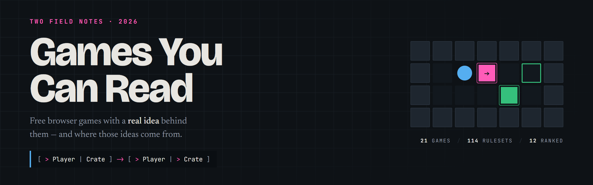

# Games You Can Read

Two researched field notes on free browser games — the ones with an actual idea
behind them, and where those ideas come from.

**Live: https://hammadshakeelai.github.io/games-you-can-read/**

| Page | What it is |
| --- | --- |
| [Source Available Arcade](https://hammadshakeelai.github.io/games-you-can-read/arcade.html) | 21 browser games grouped by the kind of idea behind them, with every licence read off the project's own repository. |
| [Mechanic First](https://hammadshakeelai.github.io/games-you-can-read/mechanic-first.html) | Where novel mechanics come from: js13k's Innovation ranking across three years, plus all 114 PuzzleScript gallery rulesets read from source, with the 12 best ranked. |

## Why the licence column has caveats

Most "best open source browser games" lists conflate four separate things: free,
open source, low compute, and good idea. These pages keep them apart, which is
why several well-regarded entries carry a flag:

- the **wipEout rewrite** has no licence file at all, may derive from the 2022
  leak, forbids any commercial use, and ships no assets — you supply the
  original PSX game data
- **Bitburner** is Apache-2.0 **plus a Commons Clause**
- **Untrusted** is CC-BY-NC-SA, non-commercial
- **Antimatter Dimensions** publishes its source but declares no licence
- **Slow Roads** and **PICO-8** are listed but flagged: free to play, not open

## Method, and its limits

Licences and play URLs come from each project's own repository or homepage, not
from directory listings. The PuzzleScript ranking is built from source: every
game in the gallery is a GitHub gist whose id sits in its play URL, so all 114
were fetched and their `RULES` sections read, then ranked by how much each
ruleset changes about Sokoban per rule spent. The rule doing the work is quoted
on the page so any claim can be checked in the editor in one click.

That is still a reading, not a playthrough. Of the games covered, only
[HexGL](https://hexgl.bkcore.com/play/), [Sandspiel](https://sandspiel.club/)
and [Snortal](https://www.puzzlescript.net/play.html?p=85124d44f37835d0bcbf)
were opened and confirmed running. The pages say so where it matters, and the
js13k entries deliberately carry no mechanic descriptions — that section reports
the competition's own peer ranking, not a session with each game.

## The screenshots

Every game entry carries a thumbnail of that game actually running. They are captured
with headless Chrome, loading each game and playing far enough to reach a
representative frame, then downscaled to 480x320 WebP - 36 images, about 370 KB in
total, all lazy-loaded with explicit dimensions so nothing reflows.

Three entries show a labelled "no capture" tile instead, because the honest answer is
that no frame exists: the **wipEout rewrite** ships no assets, **Slow Roads** refuses
to run without a real GPU, and **Hanab Live** needs a sign-in before it shows a game.

Producing the captures also caught two dead links, now fixed: Untrusted had moved to
`alexnisnevich.github.io`, and Hextris's own declared homepage `hextris.io` has lapsed
(the live game is at `hextris.github.io`).

Games belong to their authors; the screenshots are here so you can see what you are
clicking into.

## Running it

Plain HTML. No build step, no dependencies, no JavaScript.

```bash
python -m http.server 8000
```

Then open <http://localhost:8000>.

## Contributing

Corrections are welcome — especially licence changes, dead links, and any entry
where the mechanic description doesn't match what the game actually does. Open
an issue or a pull request.

Researched and written with [Claude Code](https://claude.com/claude-code).
